# Traycer AI - Complete Workflow Documentation

## Overview
This document details the complete user journey from GitHub connection through repository import to implementation plan generation and execution tracking.

## User Journey Flow

### Phase 1: Initial Setup & Authentication

#### Step 1.1: GitHub OAuth Authentication
**Files Involved:**
- `app/components/GitHubImport.tsx` (Frontend)
- `app/api/auth/github/callback/route.ts` (OAuth Handler)

**Process Flow:**
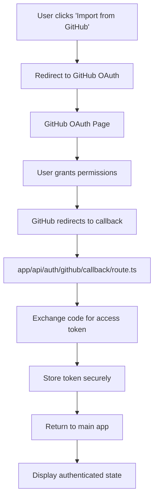

**Key Functions:**
- `GitHubImport.tsx:handleAuth()` - Initiates OAuth flow
- `callback/route.ts:POST()` - Handles OAuth callback and token exchange
- Token validation and storage in browser session

#### Step 1.2: Repository Selection
**Files Involved:**
- `app/components/GitHubImport.tsx`
- `app/api/github/route.ts`

**Process Flow:**
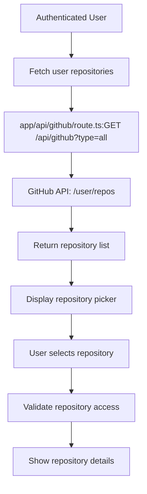

### Phase 2: Repository Import & Initial Indexing

#### Step 2.1: Repository Synchronization
**Files Involved:**
- `app/components/GitHubImport.tsx`
- `app/lib/githubService.ts`
- `app/lib/merkleTree.ts`
- `app/lib/similaritySearch.ts`

**Detailed Process Flow:**
```mermaid
graph TD
    A[User clicks 'Import Repository'] --> B[Initialize sync progress]
    B --> C[Create GitHubService instance]
    C --> D[Fetch repository contents]
    D --> E[GitHub API: GET /repos/{owner}/{repo}/contents]
    E --> F[Recursive directory traversal]
    F --> G[Filter binary/excluded files]
    G --> H[Create Merkle tree for change detection]
    H --> I[app/lib/merkleTree.ts:createMerkleTree()]
    I --> J[Process files for indexing]
    J --> K[Extract code structure via AST]
    K --> L[app/lib/codebaseParser.ts:parseFile()]
    L --> M[Generate semantic chunks]
    M --> N[app/lib/semanticChunking.ts:createChunks()]
    N --> O[Create vector embeddings]
    O --> P[app/lib/vectorEmbeddings.ts:generateEmbeddings()]
    P --> Q[Store in Pinecone vector DB]
    Q --> R[app/lib/pineconeService.ts:upsertVectors()]
    R --> S[Setup webhook for auto-sync]
    S --> T[GitHub API: POST /repos/{owner}/{repo}/hooks]
    T --> U[Store sync metadata]
    U --> V[Update UI with completion status]
```

**Key Data Structures:**
```typescript
interface SyncProgress {
  phase: 'fetching' | 'processing' | 'indexing' | 'complete';
  progress: number; // 0-100
  filesProcessed: number;
  totalFiles: number;
  currentFile?: string;
  errors: string[];
}
```

#### Step 2.2: Initial Codebase Analysis
**Files Involved:**
- `app/lib/codebaseParser.ts`
- `app/lib/contextAssembly.ts`
- `app/lib/semanticChunking.ts`

**Analysis Pipeline:**
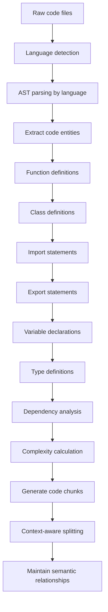

### Phase 3: Plan Generation

#### Step 3.1: Context Assembly
**Files Involved:**
- `app/lib/contextAssembly.ts`
- `app/lib/openAIService.ts`
- `app/lib/similaritySearch.ts`

**Context Preparation Flow:**
```mermaid
graph TD
    A[User prompt received] --> B[Analyze prompt intent]
    B --> C[Search for relevant code]
    C --> D[app/lib/similaritySearch.ts:search()]
    D --> E[Pinecone vector similarity search]
    E --> F[Rank and filter results]
    F --> G[Select top-k relevant chunks]
    G --> H[Assemble context window]
    H --> I[Optimize for token limits]
    I --> J[Include file metadata]
    J --> K[Add project structure info]
    K --> L[Prepare final context]
```

**Context Assembly Algorithm:**
1. **Query Expansion**: Enhance user prompt with semantic variations
2. **Multi-modal Search**: Combine vector similarity with keyword matching
3. **Relevance Filtering**: Remove low-relevance chunks based on scores
4. **Context Optimization**: Fit maximum relevant information within token limits
5. **Relationship Preservation**: Include related code chunks and dependencies

#### Step 3.2: AI Plan Generation
**Files Involved:**
- `app/lib/openAIService.ts`
- `app/components/PlanDisplay.tsx`

**Generation Pipeline:**
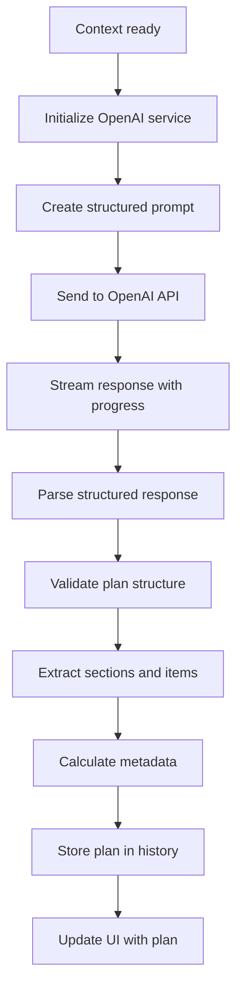

**Plan Structure:**
```typescript
interface GeneratedPlan {
  id: string;
  title: string;
  overview: string;
  sections: PlanSection[];
  metadata: PlanMetadata;
}

interface PlanSection {
  id: string;
  title: string;
  type: 'overview' | 'files' | 'dependencies' | 'steps';
  content: string;
  items: PlanItem[];
  priority: 'high' | 'medium' | 'low';
}
```

### Phase 4: Plan Refinement & Interaction

#### Step 4.1: Follow-up Questions
**Files Involved:**
- `app/lib/clarifyingQuestions.ts`
- `app/components/ClarifyingQuestions.tsx`

**Interactive Refinement:**
```mermaid
graph TD
    A[Plan generated] --> B[AI analyzes plan completeness]
    B --> C[Identify ambiguous areas]
    C --> D[Generate clarifying questions]
    D --> E[Present to user]
    E --> F[User provides answers]
    F --> G[Incorporate answers into context]
    G --> H[Regenerate refined plan]
    H --> I[app/lib/openAIService.ts:refinePlan()]
```

#### Step 4.2: Plan Refinement
**Files Involved:**
- `app/page.tsx:handleRefinePlan()`
- `app/lib/openAIService.ts:generateImplementationPlan()`

**Refinement Process:**
```mermaid
graph TD
    A[User provides feedback] --> B[Combine original prompt + feedback]
    B --> C[Create contextual prompt]
    C --> D[Include conversation history]
    D --> E[Generate refined plan]
    E --> F[Compare with original]
    F --> G[Highlight changes]
    G --> H[Save as new version]
    H --> I[app/lib/planHistory.ts:savePlan()]
```

### Phase 5: Implementation Tracking

#### Step 5.1: Progress Tracking
**Files Involved:**
- `app/components/PlanProgress.tsx`
- `app/lib/planHistory.ts`

**Tracking Workflow:**
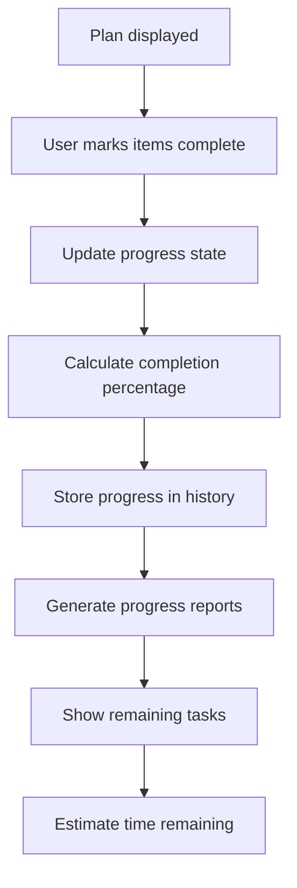

#### Step 5.2: Plan History & Comparison
**Files Involved:**
- `app/components/PlanHistory.tsx`
- `app/lib/planHistory.ts`

**History Management:**
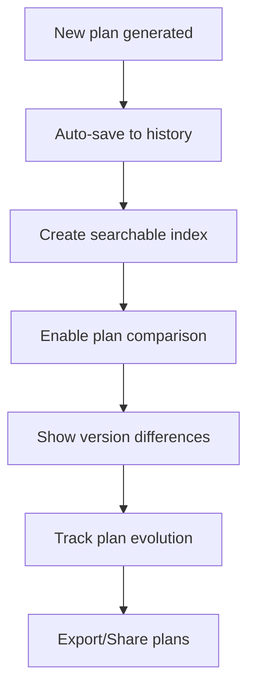

### Phase 6: Auto-Sync & Webhook Processing

#### Step 6.1: Webhook Event Processing
**Files Involved:**
- `app/api/github/webhook/route.ts`
- `app/lib/githubService.ts`
- `app/lib/merkleTree.ts`

**Webhook Flow:**
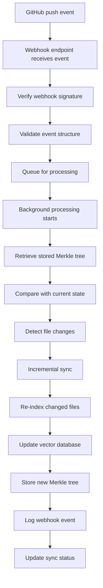

**Change Detection Algorithm:**
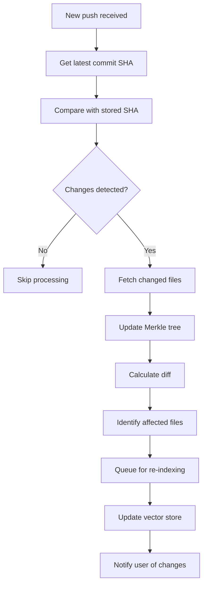

#### Step 6.2: Incremental Indexing
**Files Involved:**
- `app/lib/githubService.ts:incrementalSync()`
- `app/lib/similaritySearch.ts`

**Incremental Update Process:**
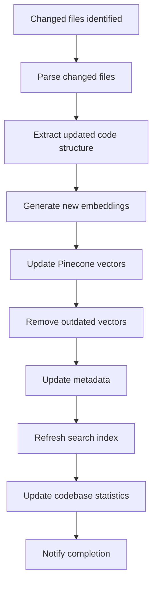

### Phase 7: Semantic Search & Analysis

#### Step 7.1: Natural Language Search
**Files Involved:**
- `app/components/SemanticSearch.tsx`
- `app/api/semantic-search/route.ts`
- `app/lib/similaritySearch.ts`

**Search Process:**
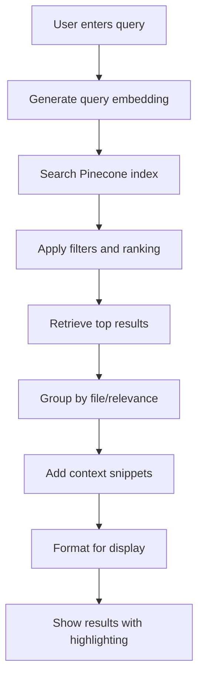

#### Step 7.2: Search Result Interaction
**Files Involved:**
- `app/components/SemanticSearchResults.tsx`

**Result Processing:**
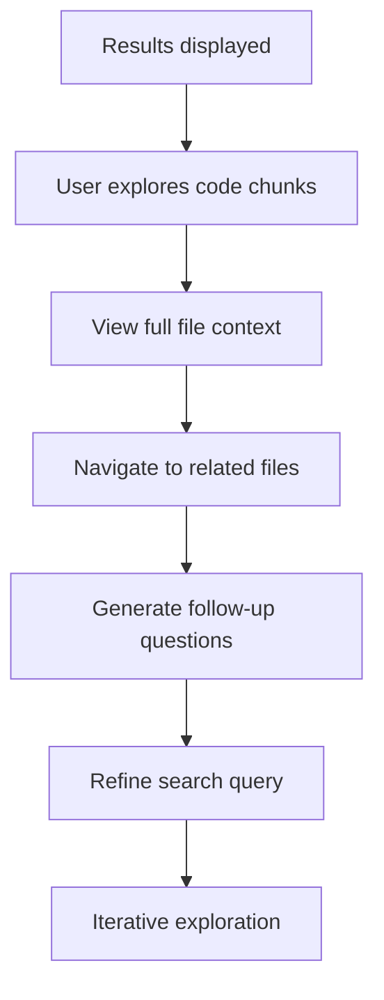

## Data Flow Architecture

### Storage Layer Interactions

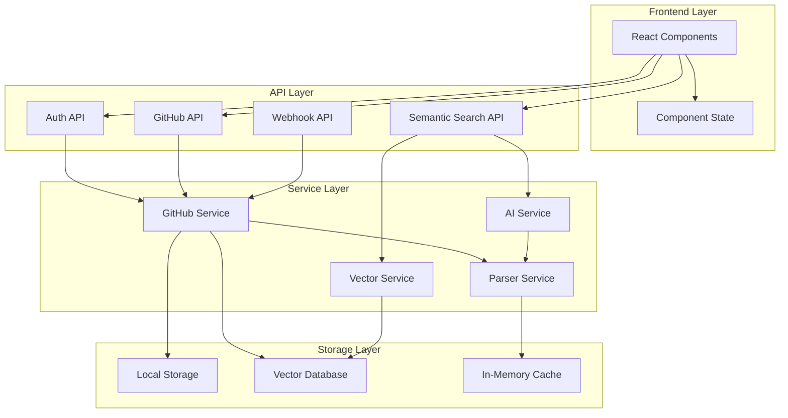

## Error Handling & Recovery

### Comprehensive Error Scenarios

1. **GitHub API Rate Limiting**
   - Automatic retry with exponential backoff
   - Queue processing for rate limit recovery
   - User notification of delays

2. **OpenAI API Quota Exceeded**
   - Graceful degradation to cached responses
   - User notification with upgrade suggestions
   - Alternative model fallback

3. **Vector Database Failures**
   - Local caching of embeddings
   - Retry mechanisms with circuit breakers
   - Offline mode capabilities

4. **Webhook Processing Failures**
   - Comprehensive logging for debugging
   - Manual retry mechanisms
   - Status tracking for failed events

## Performance Optimizations

### Caching Strategies
- **Embedding Cache**: Store frequently accessed embeddings
- **Parsed Code Cache**: Cache AST parsing results
- **Search Result Cache**: Cache common search queries
- **Metadata Cache**: Cache repository and file metadata

### Batch Processing
- **Bulk Vector Operations**: Process multiple files together
- **Parallel API Calls**: Concurrent processing where possible
- **Progressive Loading**: Stream results as they become available

### Incremental Updates
- **Merkle Tree Diffing**: Efficient change detection
- **Selective Re-indexing**: Only update changed files
- **Partial Updates**: Update only affected vector clusters

This comprehensive workflow ensures that Traycer AI provides a seamless, intelligent, and efficient experience for users working with codebases, from initial import through ongoing development and maintenance.
